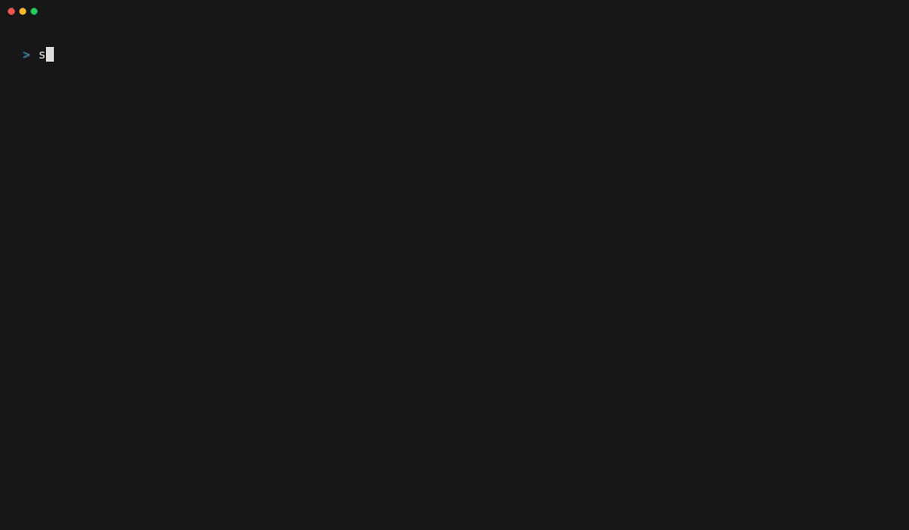

# Stock Price CLI

A professional terminal-based portfolio tracker that provides real-time stock prices, daily performance, and an upcoming dividend calendar. It handles multiple currencies automatically and features a smooth, live-updating interface.



## Features

- 📊 **Real-time Portfolio Summary**: Tracks price, quantity, daily change, and monthly % change with a clean, formatted table.
- 💹 **Cost Basis & Returns**: Record what you paid and see unrealized profit/loss and return % per position and overall.
- 📈 **Portfolio History & Benchmark**: Tracks what your portfolio was actually worth day by day, and compares it against an index.
- 🥧 **Allocation**: Position weights and the currency you are really exposed to.
- 🎯 **Analyst Consensus**: Shows the analyst rating and upside to the mean price target for each holding, with an arrow when the consensus shifted over the last month.
- 🤖 **JSON Output**: `--json` emits the whole snapshot as structured data for scripts, dashboards, or an AI assistant.
- 📱 **Telegram Bot**: Check the portfolio from your phone with `/portfolio`, `/holding`, `/dividends`.
- 🔌 **MCP Server**: Let Claude (or any MCP client) read your portfolio and keep your holdings up to date as you buy and sell.
- 📰 **Related News**: Shows recent business news articles for your portfolio tickers with summaries and clickable links.
- 💰 **Dividends**: Upcoming ex-dividend dates plus the income actually received over the last 12 months, with yield and yield-on-cost.
- 💱 **Multi-Currency Support**: Automatically converts holdings to your target currency (USD, EUR, SEK, etc.) using live exchange rates.
- ⌚ **Watch Mode**: Update your portfolio in real-time with the `--watch` flag.
- ⚙️ **External Configuration**: Managed via a simple YAML file in your home directory.
- 🚀 **Automatic Updates**: Centralized versioning and automated Homebrew releases.

## Installation

### 1. Using Homebrew (Recommended)

You can install the CLI using the `artback/stock-change` tap:

```bash
# Tap the repository
brew tap artback/stock-change

# Install the tool
brew install stock-price
```

### 2. Manual Installation (Development)

If you want to run it locally from the source:

```bash
git clone git@github.com:artback/stock-change.git
cd stock-change
python3 -m venv venv
source venv/bin/activate
pip install .
```

## Configuration

The CLI looks for a configuration file at `~/.stock_price.yaml`. Create this file to define your stock holdings and preferred currency:

```yaml
holdings:
  SVOL-B.ST: 8367   # Swedish Stock
  AAPL: 10          # US Stock
  MC.PA: 45         # French Stock
currency: EUR       # Target currency for total value and conversion
benchmark: ^GSPC    # Optional: compare your 30-day move against an index
```

### Recording what you paid

Give a holding a `cost` and the tool can report profit and loss, not just
current value. Both forms work, and you can mix them freely:

```yaml
holdings:
  AAPL:
    qty: 10
    cost: 185.20    # average price paid per share
  IUSA.DE: 720      # no cost recorded — still tracked, just no P/L
currency: EUR
```

When you buy more, `add_shares` blends the price you paid into a weighted
average — 10 at 100 plus 10 at 200 becomes 20 at 150, not 20 at 200. Selling
leaves the average untouched. `set_holding` replaces it outright, since that
means "this is the position".

`cost` is per share in the **ticker's own currency**, the way a contract note
reads. Long-run returns are therefore computed in that currency and exclude FX
movement since you bought: without the purchase-date exchange rate, converting
a historical cost at today's rate would fold years of currency drift into what
looks like a stock return. The P/L *amount* is converted for display.

The **daily** change is different — both sides of it are datable, so it is
computed in your target currency with the currency move included. A SEK holding
that rose 0.2% on a day the krona fell 0.6% against the euro shows as a loss for
a euro-reporting portfolio, because that is what happened to its value.

## Usage

Once installed, simply run the command:

```bash
# Standard view (uses ~/.stock_price.yaml)
stock-price

# Use a custom configuration file
stock-price --config ./my_stocks.yaml

# Use an environment variable for configuration
export STOCK_PRICE_CONFIG="./my_stocks.yaml"
stock-price

# Live watch mode (auto-refresh; throttles to 5 min when markets are closed)
stock-price --watch

# Set the refresh interval (seconds) in watch mode
stock-price --watch --interval 15

# Speed up repeated one-shot runs by reusing a recent snapshot (seconds).
# Also settable via the STOCK_PRICE_CACHE_TTL environment variable.
stock-price --cache-ttl 60
```

### Performance and allocation

With a cost basis recorded, the summary table gains `P/L` and `Return %`
columns, and the dividends table gains 12-month income, yield and
yield-on-cost. An allocation panel shows position weights and currency
exposure — the converted totals otherwise hide which currencies you are
actually holding.

The trend panel is labelled according to what it can honestly show:

- **`30D PORTFOLIO`** — what your portfolio was actually worth, from values
  recorded each time you run the tool (kept in `~/.stock_price_history.json`).
- **`30D BASKET`** — the fallback until enough days have been recorded: today's
  holdings priced backwards over 30 days. Useful, but it is the market
  performance of your *current* basket, not your portfolio's history. If you
  bought a position yesterday, this line pretends you held it all month.

Set a `benchmark` (in the config, or `--benchmark ^OMX`) to see the index's
move over the same window and the gap in percentage points.

### Analyst consensus

Each holding shows an `Analysts` column (the consensus rating and how many
analysts cover it) and a `Target` column (the upside to their mean price
target). An arrow marks a consensus that moved over the last month — `↑` for an
upgrade, `↓` for a downgrade.

The columns only appear when at least one holding has coverage; index funds and
most small caps have none. This data comes from the rate-limit-prone
fundamentals endpoint, so it is refreshed at most every 10 minutes, never on the
fast price-refresh cycle.

```bash
# Skip analyst data entirely
stock-price --no-analysts
```

Note that these are third-party analyst opinions, reported as-is. Consensus
ratings skew bullish across the market, and a price target is a forecast, not a
valuation.

### JSON output

```bash
stock-price --json
```

Prints the full snapshot — positions, totals, analyst data, dividends, news and
the 30-day history — as JSON on stdout, with diagnostics on stderr. Useful for
scripting, and for handing your portfolio to an AI assistant:

```bash
stock-price --json | jq '.positions[] | {symbol, daily_change_pct, analysts: .analysts.consensus}'
```

Each position carries a `status` of `ok`, `stale` (last refresh failed, figures
are the last known good ones) or `error` (never loaded). The payload is versioned
via `schema_version`, and `--json` honours `--cache-ttl` — a cached snapshot is
flagged with `"cached": true` and its age. It cannot be combined with `--watch`.

## MCP Server (AI assistants)

An MCP server exposes the portfolio to Claude and other MCP clients, so you can
ask "how's my portfolio doing?" or say "I bought 5 more Apple" in conversation.

```bash
pip install "stock-price[mcp]"
```

Register it with your client — for Claude Code:

```bash
claude mcp add stock-price -- stock-price-mcp
```

For Claude Desktop, add this to `claude_desktop_config.json`:

```json
{
  "mcpServers": {
    "stock-price": {
      "command": "stock-price-mcp"
    }
  }
}
```

It reads the same `~/.stock_price.yaml` as the CLI.

### Tools

| Tool | Purpose |
| --- | --- |
| `get_portfolio` | Whole portfolio: values, changes, analysts, dividends, news |
| `get_holding` | One position in detail |
| `get_analyst_view` | Ratings and price targets for any ticker, held or not |
| `list_holdings` | Configured tickers and share counts (no prices fetched) |
| `set_holding` | Set a position to an exact share count, optionally with cost |
| `add_shares` | Add shares after a purchase, or subtract after a sale |
| `remove_holding` | Drop a ticker entirely |

**The write tools are bookkeeping only.** They edit your local holdings file to
record what you already own. Nothing in this project places an order, contacts a
broker, or moves money — and the tool descriptions tell the model so explicitly.

Editing is defensive: an unrecognised ticker is refused rather than silently
written (a typo would quietly break your portfolio total), the previous file is
kept as a `.bak`, writes are atomic, and the new contents are parsed before the
real file is touched. With the `mcp` extra installed, comments and key order in
your YAML survive an edit.

Both write tools take an optional `cost`, so "I bought 5 more Apple at 310"
records the purchase price as well as the share count.

`set_holding` and `add_shares` mean different things — "I hold 15 in total"
versus "I bought 5 more" — so it's worth confirming the numbers your assistant
read back to you.

## Telegram bot

Check the portfolio from your phone. The bot is read-only — it reports, and
cannot edit holdings or place trades.

```bash
pip install stock-price          # no extra dependencies needed
export TELEGRAM_TOKEN="...";  export TELEGRAM_ALLOWED_CHAT_IDS="123456789"
stock-price-bot
```

| Command | Shows |
| --- | --- |
| `/portfolio`, `/p` | Value, day change and P/L, biggest holding first. Tickers link to Yahoo Finance |
| `/holding <TICKER>`, `/h` | One position in detail |
| `/dividends`, `/d` | Upcoming payouts and 12-month income |
| `/allocation`, `/a` | Position weights and currency exposure |
| `/news`, `/n` | Recent headlines |

### Finding your chat ID

Start the bot without `TELEGRAM_ALLOWED_CHAT_IDS` and message it. It replies
with your chat ID and serves nothing else — no portfolio data is exposed while
it is unconfigured. Put that ID in the allowlist and restart.

A Telegram bot answers anyone who finds it, so once configured the allowlist is
the only thing keeping your portfolio private: unknown chats get silence.

A ready-to-run Nomad job for a home cluster is in
[`deploy/nomad/stock-bot.nomad.hcl`](deploy/nomad/stock-bot.nomad.hcl). It keeps
the token in a Nomad Variable rather than the jobspec, and mounts a volume so
the recorded portfolio history survives restarts.

Tickers that fail to load (network/rate-limit errors or invalid symbols) are
retried with backoff and, if still unavailable, shown as a stale `⚠` / `error`
row rather than silently disappearing — so the portfolio total is never quietly
wrong.

## Maintenance

This project uses an automated release workflow:
1. Update the version in the `VERSION` file.
2. Push to `main`.
3. GitHub Actions will automatically:
    - Update the Homebrew formula in `artback/homebrew-stock-change`.
    - Regenerate the `demo.gif` using VHS.

## License

This project is licensed under the MIT License - see the [LICENSE](LICENSE) file for details.
